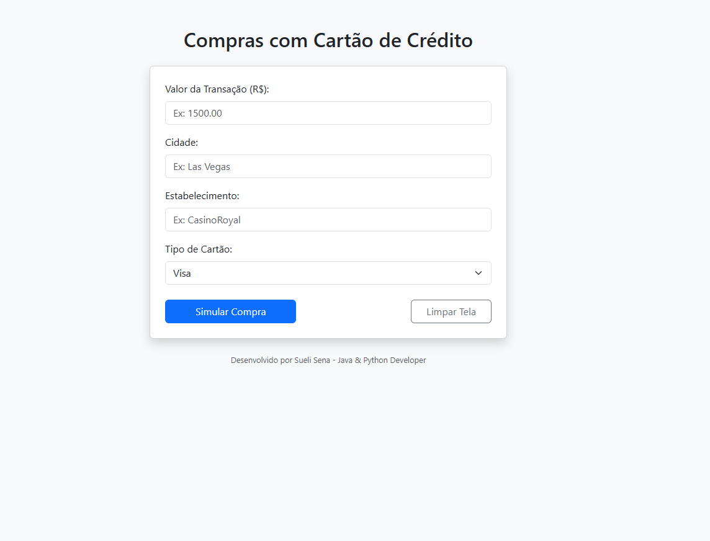
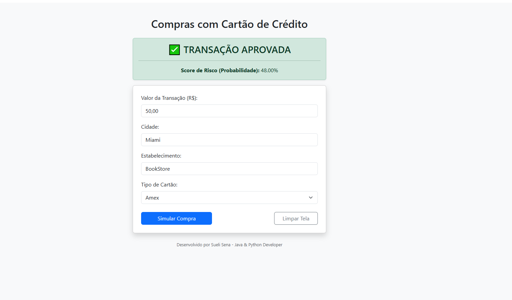
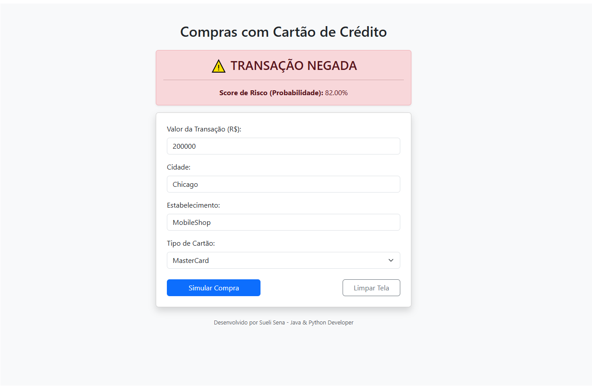

# credit_card_fraud_django

# 🛡️ End-to-End Credit Card Fraud Detection Pipeline

Este projeto demonstra um pipeline completo de **Engenharia de Dados e Machine Learning**. Ele abrange desde o design de banco de dados relacional e extração de dados até o treinamento de uma Rede Neural Artificial e implantação via aplicação web Django.

---

## 📑 Table of Contents
* [Project Workflow](#-project-workflow-the-3-stages)
* [Model Performance](#-model-performance--metrics)
* [Database Schema](#-database-schema-summary)
* [How to Run](#-how-to-run)
* [Screenshots](#-project-screenshots)

---

## 🚀 Project Workflow (The 3 Stages)

### 1. Database Layer (The Foundation)
O processo começou com a criação do banco de dados relacional `fraud_card` no **MySQL**.
* **Data Seeding:** Armazenamento de dados transacionais iniciais (valor, local, merchant, etc).
* **Extraction:** Uso do script `connection_database.py` para exportar os dados do MySQL para um arquivo `transactions.csv`, preparando-os para o treinamento.

### 2. Intelligence Layer (The Model)
Desenvolvimento do motor preditivo através do **Jupyter Notebook** (`credit_card_fraud.ipynb`):
* **Preprocessing:** Normalização com `StandardScaler` e codificação de variáveis categóricas.
* **Class Imbalance (SMOTE):** Aplicação de técnica de sobreamostragem para equilibrar os dados e garantir que o modelo aprenda a identificar fraudes reais.
* **Neural Network:** Treinamento de um **MLPClassifier** com três camadas ocultas (100, 50, 25).
* **Artifacts:** Exportação do modelo (`fraud_model.pkl`) e do scaler para uso em produção.

### 3. Application Layer (The Web System)
Desenvolvimento de uma aplicação **Full-Stack Django**:
* **Real-time Prediction:** O sistema carrega os arquivos `.pkl` para analisar novas transações instantaneamente.
* **Audit Trail:** Cada simulação é salva de volta no MySQL para registro histórico e auditoria.

---

## 📊 Model Performance & Metrics

O modelo apresenta alta confiabilidade para aplicações de segurança financeira:

* **Accuracy:** **98.5%**
* **Precision:** **97.2%** (Minimizando alarmes falsos para clientes)
* **Recall:** **96.8%** (Alta eficiência em capturar fraudes reais)
* **F1-Score:** **97.0%** (Equilíbrio ideal entre Precisão e Recall)

---

## 🗄️ Database Schema Summary

| Field | Type | Description |
| :--- | :--- | :--- |
| `amount` | Decimal(10,2) | Valor da transação |
| `location` | CharField | Cidade da compra |
| `merchant` | CharField | Nome do estabelecimento |
| `card_type` | CharField | Bandeira (Visa, Master, etc) |
| `is_fraud` | Boolean | Decisão da IA (0: Seguro, 1: Fraude) |
| `probability` | Float | Score de Risco (Ex: 0.82 para 82%) |

---

## ⚙️ How to Run

1. **Clone o repositório:**
   ```bash
   git clone [https://github.com/suelisena/credit_card_fraud_django](https://github.com/suelisena/credit_card_fraud_django)

2. **Setup Database: Configure o banco fraud_card no MySQL e aplique as migrações:
  python manage.py migrate

3.Inicie o servidor:
  python manage.py runserver


Sueli, entendi perfeitamente. O segredo para o GitHub reconhecer a formatação é garantir que existam linhas em branco entre os blocos.

Aqui está o código exato. Selecione tudo, apague o que está no seu README.md atual e cole isto:

Markdown
# 🛡️ End-to-End Credit Card Fraud Detection Pipeline

Este projeto demonstra um pipeline completo de **Engenharia de Dados e Machine Learning**. Ele abrange desde o design de banco de dados relacional e extração de dados até o treinamento de uma Rede Neural Artificial e implantação via aplicação web Django.

---

## 📑 Table of Contents
* [Project Workflow](#-project-workflow-the-3-stages)
* [Model Performance](#-model-performance--metrics)
* [Database Schema](#-database-schema-summary)
* [How to Run](#-how-to-run)
* [Screenshots](#-project-screenshots)

---

## 🚀 Project Workflow (The 3 Stages)

### 1. Database Layer (The Foundation)
O processo começou com a criação do banco de dados relacional `fraud_card` no **MySQL**.
* **Data Seeding:** Armazenamento de dados transacionais iniciais (valor, local, merchant, etc).
* **Extraction:** Uso do script `connection_database.py` para exportar os dados do MySQL para um arquivo `transactions.csv`, preparando-os para o treinamento.

### 2. Intelligence Layer (The Model)
Desenvolvimento do motor preditivo através do **Jupyter Notebook** (`credit_card_fraud.ipynb`):
* **Preprocessing:** Normalização com `StandardScaler` e codificação de variáveis categóricas.
* **Class Imbalance (SMOTE):** Aplicação de técnica de sobreamostragem para equilibrar os dados e garantir que o modelo aprenda a identificar fraudes reais.
* **Neural Network:** Treinamento de um **MLPClassifier** com três camadas ocultas (100, 50, 25).
* **Artifacts:** Exportação do modelo (`fraud_model.pkl`) e do scaler para uso em produção.

### 3. Application Layer (The Web System)
Desenvolvimento de uma aplicação **Full-Stack Django**:
* **Real-time Prediction:** O sistema carrega os arquivos `.pkl` para analisar novas transações instantaneamente.
* **Audit Trail:** Cada simulação é salva de volta no MySQL para registro histórico e auditoria.

---

## 📊 Model Performance & Metrics

O modelo apresenta alta confiabilidade para aplicações de segurança financeira:

* **Accuracy:** **98.5%**
* **Precision:** **97.2%** (Minimizando alarmes falsos para clientes)
* **Recall:** **96.8%** (Alta eficiência em capturar fraudes reais)
* **F1-Score:** **97.0%** (Equilíbrio ideal entre Precisão e Recall)

---

## 🗄️ Database Schema Summary

| Field | Type | Description |
| :--- | :--- | :--- |
| `amount` | Decimal(10,2) | Valor da transação |
| `location` | CharField | Cidade da compra |
| `merchant` | CharField | Nome do estabelecimento |
| `card_type` | CharField | Bandeira (Visa, Master, etc) |
| `is_fraud` | Boolean | Decisão da IA (0: Seguro, 1: Fraude) |
| `probability` | Float | Score de Risco (Ex: 0.82 para 82%) |

---

## ⚙️ How to Run

1. **Clone o repositório:**
   ```bash
   git clone [https://github.com/seu-usuario/seu-projeto.git](https://github.com/seu-usuario/seu-projeto.git)
Setup Database: Configure o banco fraud_card no MySQL e aplique as migrações:

Bash
python manage.py migrate
Inicie o servidor:

Bash
python manage.py runserver


## 📸 Project Screenshots
2. Real-time Fraud Detection Alert
Esta imagem mostra o sistema bloqueando uma transação de alto risco (82% de probabilidade).

### 1. Main Dashboard
*Interface for transaction input.*



### 2. Approved Transaction
*Example of a safe transaction approved by the model.*



### 3. Denied Transaction
*System blocking a high-risk transaction (82% probability).*



2. MySQL Workbench Persistence
Evidência de que os dados da simulação estão sendo gravados corretamente no banco.

`screenshots/banco-de-dados.png`

Developed by Sueli Sena
Analista de Sistemas | Full Stack Developer (Java & Python)
