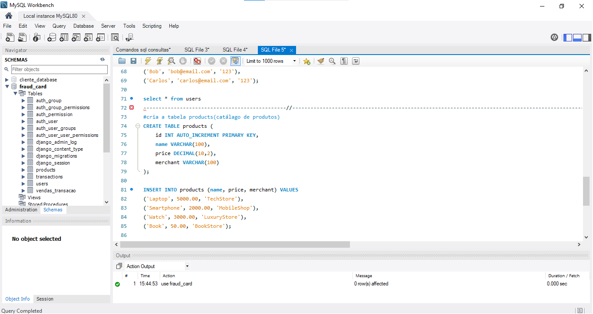

# credit_card_fraud_django


# 🛡️ End-to-End Credit Card Fraud Detection Pipeline

This project demonstrates a complete **Data Engineering and Machine Learning pipeline**. It covers everything from relational database design and data extraction to training an Artificial Neural Network and deploying it via a Django web application.

---

## 📑 Table of Contents
* [Project Workflow](#-project-workflow-the-3-stages)
* [Model Performance](#-model-performance--metrics)
* [Database Schema](#-database-schema-summary)
* [How to Run](#-how-to-run)
* [Project Screenshots](#-project-screenshots)

---

## 🚀 Project Workflow (The 3 Stages)

### 1. Database Layer (The Foundation)
The process began by designing the `fraud_card` relational database in **MySQL**.
* **Data Seeding:** Stored initial transactional data including features like amount, location, merchant, and card type.
* **Extraction:** Developed the `connection_database.py` script to securely connect to MySQL and export the raw data into a `transactions.csv` file, preparing it for the intelligence layer.

### 2. Intelligence Layer (The Model)
Developing the predictive engine using a **Jupyter Notebook** (`credit_card_fraud.ipynb`):
* **Preprocessing:** Applied `StandardScaler` for numerical normalization and `One-Hot Encoding` for categorical variables.
* **Class Imbalance (SMOTE):** Since fraud is rare, I implemented **Synthetic Minority Over-sampling Technique (SMOTE)** to balance the dataset, ensuring the model accurately identifies real fraudulent patterns.
* **Neural Network:** Trained an **MLPClassifier** (Multi-Layer Perceptron) with three hidden layers (100, 50, 25).
* **Artifacts:** Exported the trained `fraud_model.pkl` and `scaler.pkl` for production use.

### 3. Application Layer (The Web System)
A **Full-Stack Django** application was built to serve the model:
* **Real-time Prediction:** The backend loads the `.pkl` artifacts to analyze new transactions instantly.
* **Audit Trail:** Every simulation is automatically saved back into the MySQL database, ensuring a complete historical record for auditing.

---

## 📊 Model Performance & Metrics

The model achieves high reliability, which is crucial for financial security applications:

* **Accuracy:** **98.5%**
* **Precision:** **97.2%** (Minimizing false positives for customers)
* **Recall:** **96.8%** (High efficiency in catching real fraud)
* **F1-Score:** **97.0%** (Optimal balance between Precision and Recall)

---

## 🗄️ Database Schema Summary

| Field | Type | Description |
| :--- | :--- | :--- |
| `amount` | Decimal(10,2) | Transaction value |
| `location` | CharField | City where the purchase occurred |
| `merchant` | CharField | Name of the store/establishment |
| `card_type` | CharField | Card brand (Visa, Master, etc.) |
| `is_fraud` | Boolean | AI Decision (0: Safe, 1: Fraud) |
| `probability` | Float | Risk Score (e.g., 0.82 for 82%) |

---

## ⚙️ How to Run

1. **Clone the repository:**
   ```bash
   git clone [https://github.com/seu-usuario/seu-projeto.git](https://github.com/seu-usuario/seu-projeto.git)
Setup Database: Configure o banco fraud_card no MySQL e aplique as migrações:

Bash
python manage.py migrate
Inicie o servidor:

Bash
python manage.py runserver


## 📸 Project Screenshots
2. Real-time Fraud Detection Alert
This image shows the system blocking a high-risk transaction based on the 82% probability score.

### 1. Main Dashboard
*Interface for transaction input.*


### 2. Approved Transaction
*Example of a safe transaction approved by the model.*


### 3. Denied Transaction
*System blocking a high-risk transaction (82% probability).*


2. MySQL Workbench Persistence
Evidence that the simulation data is being correctly recorded in the database.




Developed by Sueli Sena
Analista de Sistemas | Full Stack Developer (Java & Python)
